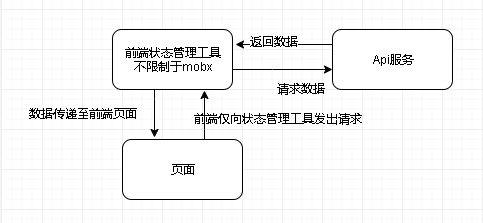

# Mobx

## 本质

是一种前端状态管理工具
用于管理状态变化以及数据变化。

数据：所有的前端需要的数据都可以由mobx保存，在需要具体数据的页面内，放入mobx内的数据元素，添加observe，即可做到实时修改。

前端基本结构如下


## mobx observable

Observable 值可以是JS基本数据类型、引用类型、普通对象、类实例、数组和映射。
用于确定一个观察数据，与action结合使用来控制数据变化。

## computed

计算值(computed values)是可以根据现有的状态或其它计算值衍生出的值。

## autorun

当使用 autorun 时，所提供的函数总是立即被触发一次，然后每次它的依赖关系改变时会再次被触发。当值发生变化时会被触发

## observe

observer 函数/装饰器可以用来将 React 组件转变成响应式组件。 它用 mobx.autorun 包装了组件的 render 函数以确保任何组件渲染中使用的数据变化时都可以强制刷新组件。 observer 是由单独的 mobx-react 包提供的。

```js
  @observer
  export default class App extends React.Component {
  
    render() {
      return (
        <div>
          <Main store={newState} />
          <AllNum store={newState} />
        </div>
      );
    }
  }
```

## action

用于改变observable对象的值
动作是任何用来修改状态的东西。 使用MobX你可以在代码中显式地标记出动作所在的位置。 动作可以有助于更好的组织代码。

[异步action参考](https://cn.mobx.js.org/best/actions.html)

## mobx严格模式

```js
import { observable, action,configure,autorun } from 'mobx';

configure({enforeActions: true})
```

## mobx的一些问题

参考[mobx 6 视图更新，mobx props更新页面不渲染的坑](https://blog.csdn.net/yangyangkl123/article/details/109506694)

* 问题： react 项目中，使用mobx, 通过action 方法修改状态后，值都能打印出来，发生了改变。但是页面没有渲染

* 原因： mobx 6 更新后，有变动, 不会自动进行更新，需要进行处理 处理方法如下
  
```js
  import { makeObservable} from "mobx";
    class OrderLine {
        constructor(){
            makeObservable(this) // 需要添加这个
        }
    }
```